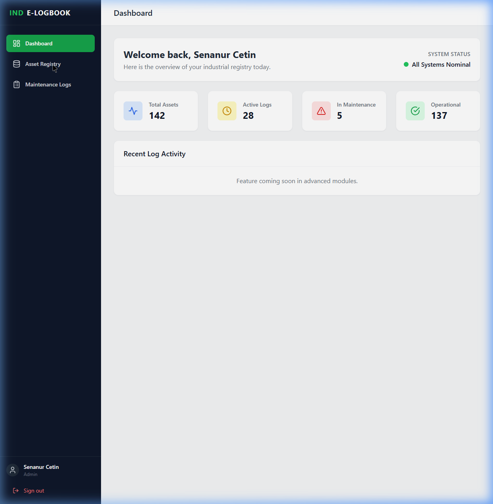
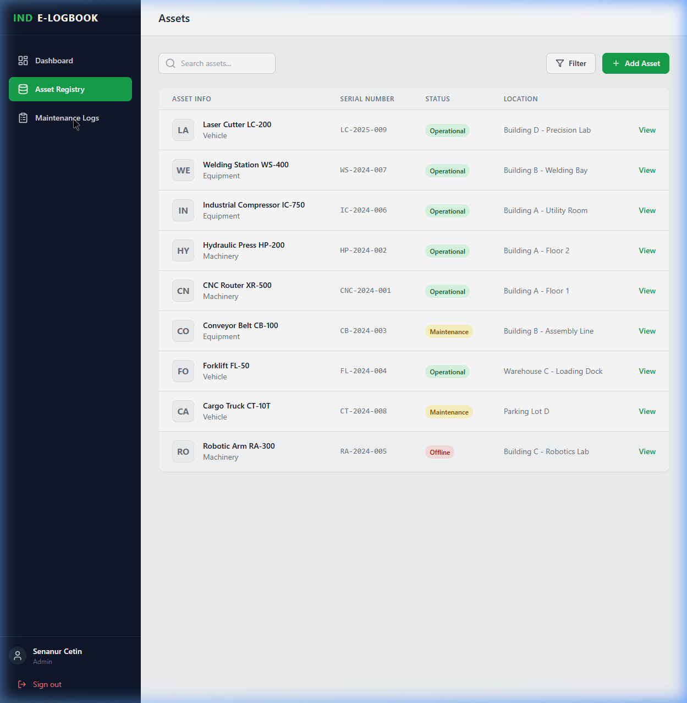
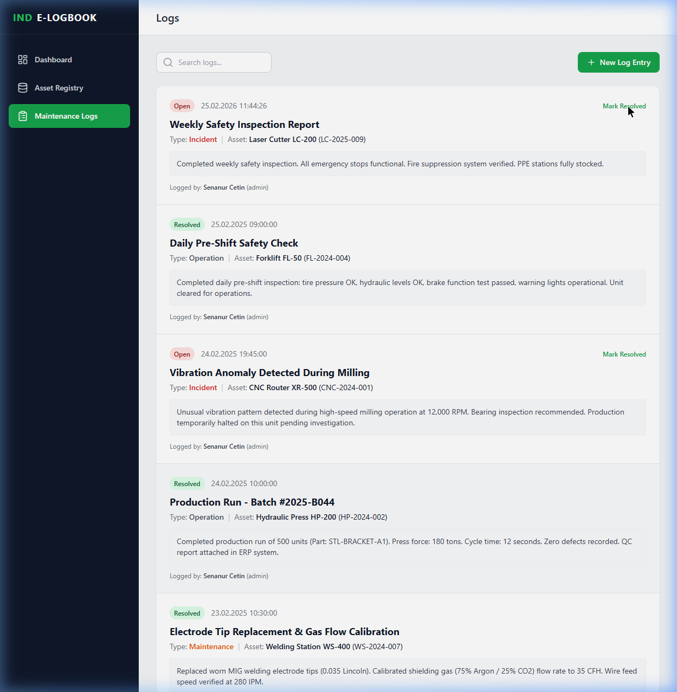

# PlantLog-MERN

PlantLog-MERN is a full-stack industrial operations platform for asset registration, maintenance logging, and shift-level incident tracking. It packages a React frontend, Node/Express backend, and MongoDB deployment model into a portfolio-ready operations product.



Demo: [Portfolio project entry](https://senanur-cetin.vercel.app/#projects)

## Why this project exists

Many plants still split maintenance history, incident notes, and asset data across spreadsheets, paper logs, and disconnected internal tools. PlantLog-MERN demonstrates how a modern operations platform can centralize those workflows for supervisors, technicians, and plant managers.

## What it does

- Maintains a centralized industrial asset registry.
- Tracks maintenance, operational, and incident logs in a structured workflow.
- Supports role-based access patterns for administrators and operators.
- Separates frontend and backend concerns for a realistic product architecture.
- Ships with Docker-based local orchestration for end-to-end evaluation.

## Architecture snapshot

- **Frontend:** React, TypeScript, Vite, Zustand, Tailwind CSS
- **Backend:** Node.js, Express, TypeScript, Mongoose
- **Data layer:** MongoDB
- **Infrastructure:** Docker and Docker Compose

## Product walkthrough

### Dashboard

Operational KPIs, status summaries, and system health are surfaced in one overview page.

### Asset registry



### Maintenance and incident logs



## Local setup

### Prerequisites

- Node.js 20+
- npm
- Docker and Docker Compose

### Environment files

```bash
copy frontend\\.env.example frontend\\.env
copy backend\\.env.example backend\\.env
```

Use `cp` instead of `copy` on macOS or Linux.

### Install and run with Docker

```bash
docker-compose up -d --build
```

### Run without Docker

```bash
cd backend
npm install
npm run build

cd ..\\frontend
npm install
npm run build
```

## Repository highlights

- `frontend/src/services/api.ts` centralizes API access for the client.
- `backend/src` contains the Express and MongoDB application layer.
- `docs/` contains UI captures and demo collateral.

## Portfolio note

This repository is intended as a realistic B2B operations software concept. It demonstrates full-stack product structure and workflow design more than polished production hardening.

## License

MIT
